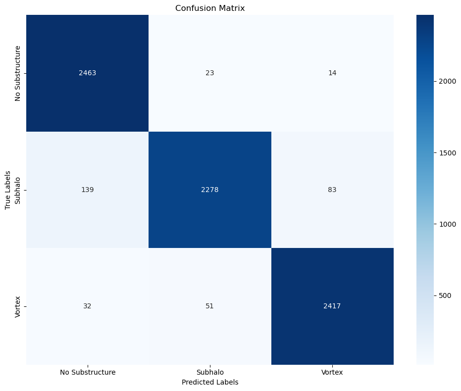

### Approach

For this task I applied two models
1. EfficientNet(b3) - Highly efficient
2. A simple CNN  - Basic model banchmarking 

## Data Augmnentation
- Flip (vertical and horizontal)
- Crop
- Rotate
- Normalization

## Model details 

### EfficientNet
Loss - CrossEntropy (standard for classification tasks) \
Epochs - 15 \
1 FC layer

### CNN with residual connections
Loss - CrossEntropy (standard for classification tasks) \
Epochs - 150 \
4 Hidden Layers and 3 FC Layers

## Results

Run reports for wandb can be found [CNN](https://api.wandb.ai/links/samkitshah1262-warner-bros-discovery/32panvs8) and [ENB3](https://api.wandb.ai/links/samkitshah1262-warner-bros-discovery/agqqjvft)

## Analysis

| Model | AUC |
| --- | --- | 
| EfficientNet | 0.9937 |	
| CNN | 0.9873 |

## Conclusion

For this task I trained two de facto algorithms for image classification. As this task does not require any specialized effort and is quite straightforward in nature, \
Focused on accuracy instead of novelty. 
