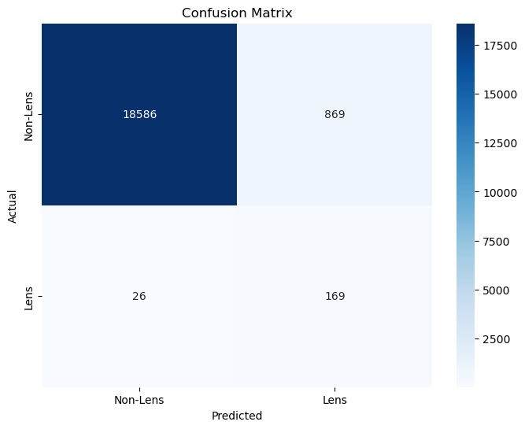

### Approach

For this task I used EfficientNet(b0) backbone reinforced by a physics loss incorporating the  gravitational lensing equation

## Architecture Overview

In order to handle the class imbalance I employed following strategies

| Aspect            | Loss Weighting                | Weighted Sampling              |
|------------------|-----------------------------|--------------------------------|
| **Focus**        | Adjusts loss calculation    | Adjusts data exposure         |
| **Implementation** | Modified loss function (`pos_weight`) | Modified data loader (sampler) |
| **Gradient Impact** | Directly scales gradients for minority | Indirectly balances gradient updates |

## Key Specifications

| Metric                | Value       |
|-----------------------|-------------|
| Training Samples      | 29,700      |
| Validation Samples    | 19,195      |
| Class Ratio           | 1:16.5      |
| Best Validation AUC   | 0.98       |
| Training Epochs       | 20          |

## Results

Run reports for wandb can be found [here](https://api.wandb.ai/links/samkitshah1262-warner-bros-discovery/x0hvptx8)

## Conclusion
The simple CNN model performs fairly well.

## Future Work
- [ ] Use better arch