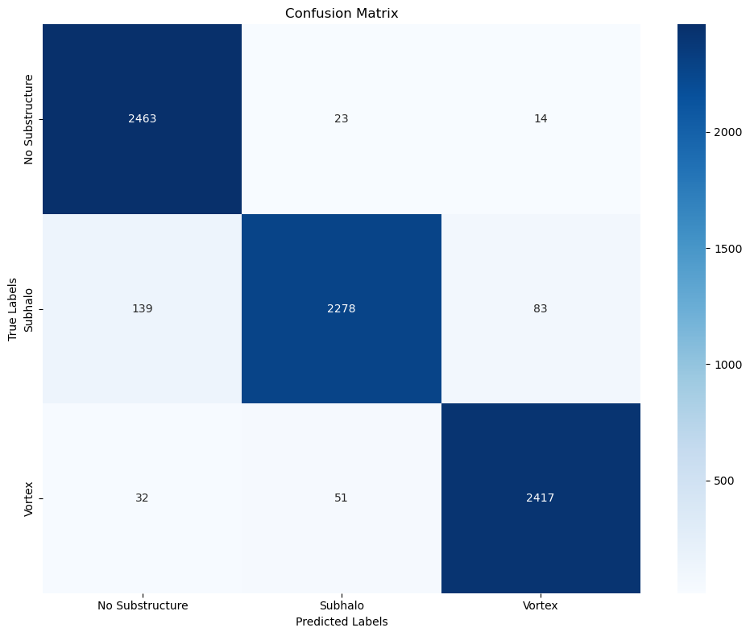

### Approach

For this task I used EfficientNet(b0) backbone reinforced by a physics loss incorporating the  gravitational lensing equation

## Architecture Overview

$$
Input Image
     │
     ├──> Encoder Backbone
     │       │
     │       └──> Angular Distortion Map
     │               │
     │               ├──> Source Image Reconstruction
     │               │        │
     │               │        └──> Physics Branch
     │               │                │
     │               │                ├──> Physics Parameters
     │               │                │       │
     │               │                │       └──> Lensing Equation
     │               │                │               │
     │               │                │               └──> Predicted Beta Coordinates
     │               │                │
     │               │                └──> Lensing Equation
     │               │                        │
     │               │                        └──> Predicted Beta Coordinates
     │
     └──> Physics Branch

$$

Input → Conv2D(1,32) → MBConv Blocks → Angular Distortion Map → Source Image \
(Input + Source Image) → Conv2D(2,32) → MBConv Blocks → θ_E, γ, φ \
Grid + Parameters → Lensing Equation → β_pred 

Component Breakdown
Component	Specification	Output Shape
Encoder	EfficientNet-B0 modified:
- Input: 1 channel
- Final Conv: 1×1
- Output: 150×150	(B,1,150,150)
Physics Branch	EfficientNet-B0 modified:
- Input: 2 channels
- Final FC: 3 neurons	(B,3)
Coordinate Grid	Precomputed normalized grid	(1,2,150,150)

### EfficientNet
Loss - CrossEntropy (standard for classification tasks) * 0.5 Physics Loss 

SIS Deflextion - 
$$
\alpha_{SIS}(\theta) = \theta_E \frac{\theta}{||\theta||}
$$

External Shear Deflection - 
$$
\alpha_{shear}(\theta) = \gamma \begin{bmatrix} \cos 2\phi & \sin 2\phi \\ \sin 2\phi & -\cos 2\phi \end{bmatrix} \theta
$$

Physics Loss - 
$$
\mathcal{L}_{total} = 1.0\mathcal{L}_{params} + 2.0\mathcal{L}_{physics} + 0.5\mathcal{L}_{recon} \
$$
Epochs - 20 

## Results

Run reports for wandb can be found [here](https://api.wandb.ai/links/samkitshah1262-warner-bros-discovery/mq13kvoz)
<!--  -->

## Analysis

| Model | AUC |
| --- | --- | 
| EfficientNet with physics | 0.9986 |	
| EfficientNet without physics  | 0.9873 |

## Conclusion
Physics trained models converge a lot faster along with a slightly better accuracy

## Future Work
- [ ] Use better arch
- [ ] Incorporate better physics consistency