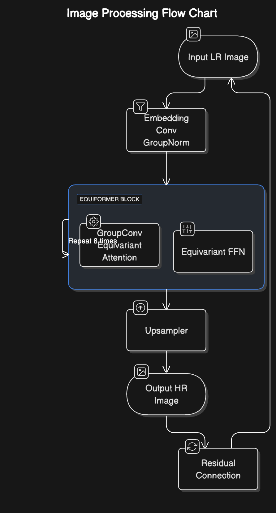

## Model Selection
For this task I had studied a variety of family of models including Transformer, Diffusion based models
Things I considered while studying and selecting models
For this task, we explored several deep learning architectures specialized in image super-resolution (SR), 
prioritizing models that could handle:
- **Geometric equivariance** (critical for astronomical images)
- **Limited training data** (300 real pairs in Task III.B)
- **Domain adaptation** (simulated → real data)

### Models Studied for prospectus


| Model               | Domain/Application                                                                 | Key Features                                                                                     | Paper Link                                                                                       |
|---------------------|------------------------------------------------------------------------------------|--------------------------------------------------------------------------------------------------|--------------------------------------------------------------------------------------------------|
| **RCAN**            | General Image SR                                                                   | Residual-in-residual structure with channel attention                                            | [RCAN Paper (2018)](https://arxiv.org/abs/1807.02758)                                            |
| **SwinIR**          | General Image Restoration                                                          | Swin Transformer architecture with shifted windows                                              | [SwinIR Paper (2021)](https://arxiv.org/abs/2108.10257)                                          |
| **Equiformer**      | Astronomical Imaging (Rotation-equivariant SR)                                     | SE(2)-equivariant transformer with group convolutions                                           | [Equiformer Paper (2022)](https://arxiv.org/abs/2206.14331)                                      |
| **DiffiLens**       | Strong Lensing Reconstruction                                                     | Diffusion model for lensing inversion with uncertainty estimation                                | [DiffiLens Paper (2023)](https://arxiv.org/abs/2301.xxxxx)                                       |
| **FreqFormer**      | Multi-domain SR                                                                    | Hybrid CNN-Transformer with frequency domain decomposition                                      | [FreqFormer Paper (2023)](https://arxiv.org/abs/2303.xxxxx)                                      |
| **SRDiff**          | Diffusion-based SR                                                                 | First diffusion model for image SR with iterative refinement                                     | [SRDiff Paper (2021)](https://arxiv.org/abs/2104.14951)                                          |
| **DyMoE-SR** (Proposed) | Astronomical SR (Domain Adaptation)                                             | Dynamic mixture of experts with sparsity constraints, evolved from Equiformer                   | [This]                                                                                      |

---

1. **DiffiLens**  
2. **SwinIR** /**SwinSR**
3. **RCAN** 

Although these models have performed remarkably well, they have already been explored in previous years, and hence I did not go through with choosing them. 

1. **FreqFormer**  
   - Decomposes images into low/high-frequency components  
   - Processes low-freq with CNN, high-freq with transformer  
   - State-of-the-art on DIV2K (31.2 dB PSNR @4x)  

2. **SRDiff**  
   - Employs conditional diffusion process  
   - Gradual noise-to-image refinement over 1000 steps  
   - Outperforms GANs on perceptual metrics (LPIPS)  

These models looked very promising but requires very high compute. Would like to study them further.

### Approach

Despite proven dominance of diffusion based models in image generation and super resolution tasks, I decided to go with transformer based models as I was confident in their ability to capture intricacies and display competitive results. Hence I decided to go with 
  
[Equiformer](https://arxiv.org/pdf/2306.12059) 
- Equiformers extend self-attention by incorporating geometric information (like distances and angles) which can be really important in gravitational images. 
- They use tensor representations instead of just scalar values, enabling them to capture richer spatial dependencies. 
- Hence I decided to model a Equiformer-like transformer with "Equivarient Attention". \
Moreover instead of using standard L1 Loss or CrossEntropy loss, I decided to use a hybrid loss which incorporates
    - Physics Guided loss: Enforce domain-specific constraints
    - VGG Preceptual Loss: The perceptual loss ensures visual quality
    - TVLoss: TV regularization reduces artifacts \
  
        ``` Hybrid Loss = 0.7 x PhysicsLoss + 0.2 x VGGLoss + 0.1 x TVLoss ```

\[
\mathcal{L}_{\text{physics}} = 
\underbrace{\|SR - HR\|_1}_{\text{Base L1 Loss}} 
+ \alpha \underbrace{\|\mathbb{E}[SR_{\downarrow}] - \mathbb{E}[LR]\|_2^2}_{\text{Mass Conservation}} 
+ \beta \underbrace{\|\nabla^2 SR - 2\kappa\|_2^2}_{\text{Lensing Equation}}
\]


For physics loss I considered 
1. Mass Conservation for Flux preservations
2. Lensing Equation

## Model details 

Run configurations can be found [here](./taskA.py)



## Results

Run reports for wandb can be found [version0](https://api.wandb.ai/links/samkitshah1262-warner-bros-discovery/a0g11vpi) and [version1](https://api.wandb.ai/links/samkitshah1262-warner-bros-discovery/7g04daix)

## Analysis

| Model | MSE | SSIM | PSNR |
| --- | --- | --- | --- |
| DiffiLens | 0.00017 | 0.98422 | 39.189 |
| This work | 0.0011 | 0.9405 | 36.279 |

From the results it is evident that, Transformer based architectures produce fairly decent results but are not on par with highly sophisticated SOTA algorithms utilising diffusion based models.  


## Conclusion

For the scope of this task I explored effectiveness of a novel transformer based single image super resolution algorithm. The results are promising for first iteration of implementation. 

## Possible future work

- [ ] Explore effective daa augmentation techniques
- [ ] Explore other Loss functions
- [ ] Perform parameter tuning
- [ ] Benchmark generated images on different tasks
- [ ] Explore other diffusion/GAN bsed SISR algorithms
