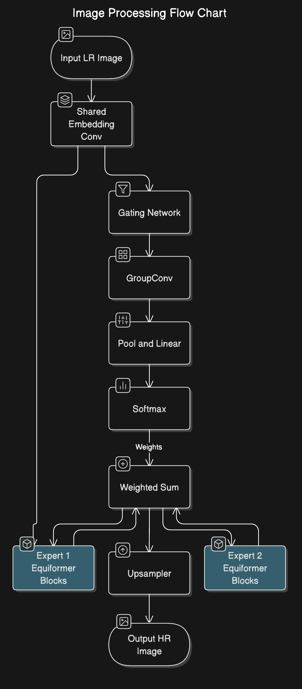

### Approach

For this task I finetuned the pre-trained model for the prior task. Moreover , I used a sparse mixture of experts network for the finetuning process. 
  
[Sparse MoE](https://arxiv.org/pdf/2212.05055) 

## Model details 

Run configurations can be found [here](./taskB.py)

## Results

Run reports for wandb can be found [version0](https://api.wandb.ai/links/samkitshah1262-warner-bros-discovery/likdicky)

## Analysis

| Model | MSE | SSIM | PSNR |
| --- | --- | --- | --- |
| DiffiLens | 0.01585 | 0.86701 | 32.94286 |		
| This work | 0.004 | 0.7272 | 25.49 |

From the results it is evident that, the trained model struggles to generalize the SR for real lensing data.

## Conclusion

For this task I tried to experiment with cutting edge algorithms such as MoE for efficient training, but the method proves to be suboptimal for the model and data used. /
Throughout the experiment I have focused on devising novel solution for the task instead of using the straightforward choices. Moreover, training has been performed for a single iteration due to time urgency for submitting the evaluation test. I am confident with more inspection and deep study, the algorithms can be refined to perform much better.

## Possible future work

- [ ] Explore effective data augmentation techniques
- [ ] Finetune/train a normal transformer block without MoE
- [ ] Explore other Loss functions
- [ ] Perform parameter tuning
- [ ] Benchmark generated images on different tasks
- [ ] Explore other diffusion/GAN bsed SISR algorithms